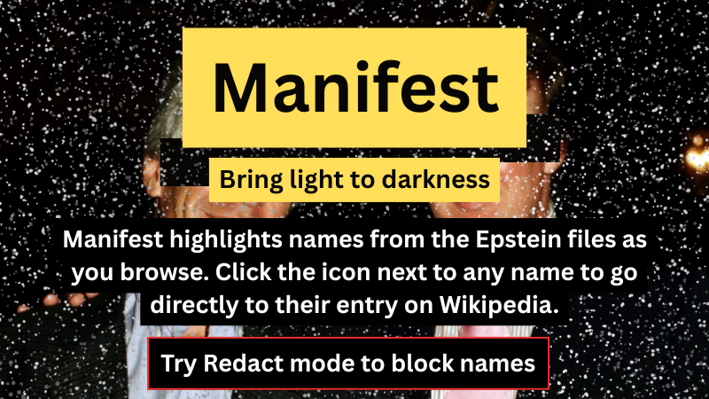

# Manifest



> *Bringing light to the darkness*

Manifest highlights names from the [Epstein files](https://en.wikipedia.org/wiki/List_of_people_named_in_the_Epstein_files) as you browse. Click the icon next to any name to go directly to their entry on Wikipedia.

---

## How it works

When you visit any webpage, Manifest scans the text for names listed in the Wikipedia article *List of people named in the Epstein files*. When a name is found:

- A small **highlighter icon** appears next to the name
- Optionally, the **name itself is highlighted** in yellow
- The extension's **toolbar badge** shows a count of total mentions on the page
- Clicking the icon opens that person's section on the Wikipedia list in a new tab

The name list is fetched from Wikipedia and cached locally, refreshing automatically once a day.

---

## Features

- **Toolbar badge** — at-a-glance count of unique Epstein file names on the current page
- **Popup** — shows which names appear on the page and how many times each occurs
- **Toggle icon** — show or hide the highlighter icon next to names
- **Toggle highlight** — show or hide the colored background on matched names
- **Color picker** — choose your highlight and icon color from 7 options
- **Redact mode** — hides names under a black bar with a red outline, like a classified document; hover over the bar to reveal the name
- **Master on/off switch** — disable entirely with one click
- Works on any website, including dynamically loaded content (SPAs, infinite scroll)

### Redact mode

Selecting **Redact** in the highlight color options replaces the colored highlight with a solid black bar outlined in red — the name is hidden from view. Hovering over the bar reveals the name in white. This is useful if you want to notice *that* a name appears without immediately seeing *who* it is, or simply to make flagged names more visually striking on the page.

---

## Important disclaimer

**Appearing in the Epstein files does not mean a person has done anything wrong.** The files include names of victims, witnesses, associates, and people mentioned only incidentally. Manifest makes no judgement about any individual — it simply shows you who appears, and lets you follow through to Wikipedia to read the context for yourself.

Matching is also by name only. Someone who shares a name with a listed person may occasionally be tagged in error. Always click through to verify.

---

## Installation

Manifest is not yet on the Chrome Web Store. To install it manually:

1. Download or clone this repository
2. Open Chrome and go to `chrome://extensions`
3. Enable **Developer mode** (toggle in the top right)
4. Click **Load unpacked**
5. Select the folder containing this repository

---

## Project structure

```
manifest-extension/
├── manifest.json              # Extension manifest (MV3)
├── background/
│   └── service-worker.js      # Fetches & caches name list, manages toolbar badge
├── content/
│   ├── names.js               # Hardcoded fallback name list (~155 people)
│   └── content.js             # Page scanner, DOM injection, highlight logic
├── icons/
│   ├── manifest.svg           # Inline icon shown next to names
│   ├── manifest-header.png    # README header image
│   ├── icon16.png
│   ├── icon48.png
│   └── icon128.png
└── popup/
    ├── popup.html             # Extension popup UI
    └── popup.js               # Popup logic
```

---

## Source

Name list sourced from Wikipedia:
[List of people named in the Epstein files](https://en.wikipedia.org/wiki/List_of_people_named_in_the_Epstein_files)
